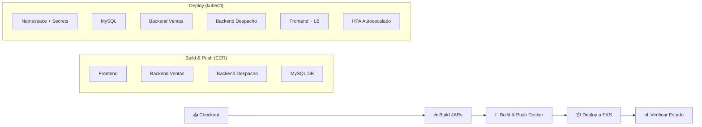

# 🛒 Inovatech — Sistema de Ventas y Despachos

<p align="center">
  
  
  
  
  
  
</p>

---

## 📋 Descripción

**Inovatech** es una aplicación web fullstack para la gestión de **ventas** y **despachos** de una tienda. El sistema permite registrar compras, generar despachos asociados, y hacer seguimiento del estado de entrega con información de camiones y reintentos.

La aplicación está desplegada en **Amazon EKS** (Elastic Kubernetes Service) con un pipeline CI/CD completamente automatizado mediante **GitHub Actions**.

---

## 🏗️ Arquitectura

```
┌──────────────────────────────────────────────────────────────────┐
│                        Amazon EKS Cluster                        │
│                                                                  │
│  ┌──────────────┐    ┌──────────────────┐   ┌────────────────┐  │
│  │   Frontend    │    │  Backend Ventas   │   │ Backend Despacho│  │
│  │  React + Vite │───▶│  Spring Boot      │   │  Spring Boot    │  │
│  │  (Nginx)      │───▶│  Puerto: 8082     │   │  Puerto: 8081   │  │
│  │  Puerto: 80   │    │  Réplicas: 2-10   │   │  Réplicas: 2-10 │  │
│  └──────┬───────┘    └────────┬─────────┘   └───────┬────────┘  │
│         │                     │                      │           │
│         │ LoadBalancer         │    ClusterIP          │           │
│         │ (público)           └──────────┬───────────┘           │
│         │                                │                       │
│         │                     ┌──────────▼──────────┐           │
│         │                     │      MySQL 8         │           │
│         │                     │   Base: tienda       │           │
│         │                     │   Puerto: 3306       │           │
│         │                     └─────────────────────┘           │
│         │                                                        │
└─────────┼────────────────────────────────────────────────────────┘
          │
          ▼
    🌐 Internet (AWS ELB)
```

---

## 📁 Estructura del Proyecto

```
inovatech-3evaluacion/
│
├── 📂 frontend/                     # Aplicación React + Vite
│   ├── src/
│   │   ├── componentes/
│   │   │   ├── Layouts/             # Navbar, Footer, Carrusel, Reviews
│   │   │   ├── CrudAdmin/           # Tablas, formularios, modales
│   │   │   └── CrudAdmin.jsx        # Vista principal del admin
│   │   └── Routes/
│   │       └── AppRoutes.jsx        # Configuración de rutas
│   ├── default.conf.template        # Config Nginx (reverse proxy)
│   ├── Dockerfile                   # Build multi-stage (Node → Nginx)
│   └── package.json
│
├── 📂 backend/
│   ├── back-Ventas_SpringBoot/      # Microservicio de Ventas
│   │   └── Springboot-API-REST/     # API REST (Java 21, Maven)
│   └── back-Despachos_SpringBoot/   # Microservicio de Despachos
│       └── Springboot-API-REST-DESPACHO/
│
├── 📂 db/
│   ├── Dockerfile                   # Imagen MySQL 8 personalizada
│   └── init.sql                     # Script de inicialización con datos
│
├── 📂 k8s/                          # Manifiestos de Kubernetes
│   ├── namespace.yaml               # Namespace del proyecto
│   ├── db-secret.yaml               # Secretos de conexión a la BD
│   ├── mysql-deployment.yaml        # Deployment de MySQL
│   ├── mysql-service.yaml           # Service interno de MySQL
│   ├── backend-deployment-ventas.yaml
│   ├── backend-service-ventas.yaml
│   ├── backend-deployment-despacho.yaml
│   ├── backend-service-despacho.yaml
│   ├── frontend-deployment.yaml
│   ├── frontend-service.yaml        # LoadBalancer público
│   ├── backend-hpa-ventas.yaml      # Autoescalado (2-10 pods, CPU 70%)
│   ├── backend-hpa-despacho.yaml    # Autoescalado (2-10 pods, CPU 70%)
│   └── frontend-hpa.yaml           # Autoescalado (2-6 pods, CPU 60%)
│
├── 📂 .github/workflows/
│   └── deploy-eks.yml               # Pipeline CI/CD completo
│
└── README.md
```

---

## 🚀 Stack Tecnológico

| Capa | Tecnología | Versión |
|------|-----------|---------|
| **Frontend** | React + Vite + TailwindCSS | React 18, Vite 5 |
| **Backend Ventas** | Spring Boot (API REST) | Java 21, Maven |
| **Backend Despacho** | Spring Boot (API REST) | Java 21, Maven |
| **Base de Datos** | MySQL | 8.x |
| **Contenedores** | Docker | Multi-stage builds |
| **Orquestación** | Kubernetes (EKS) | v1.29 |
| **Registro de Imágenes** | Amazon ECR | — |
| **CI/CD** | GitHub Actions | — |
| **Load Balancer** | AWS ELB (internet-facing) | — |

---

## ⚙️ Pipeline CI/CD

El pipeline se ejecuta automáticamente en cada **push a `main`** o de forma manual (`workflow_dispatch`).

### Etapas del Pipeline



### Flujo detallado

1. **Checkout** — Descarga el código fuente
2. **Configurar Java 21** — Instala JDK Temurin con caché Maven
3. **Configurar AWS** — Autenticación con `aws-access-key-id`, `aws-secret-access-key` y `aws-session-token`
4. **Login ECR** — Autenticación al registro de contenedores
5. **Build JARs** — Compila los dos backends con Maven (`-DskipTests`)
6. **Build & Push** — Construye 4 imágenes Docker y las sube a ECR
7. **Deploy MySQL** — Crea namespace, secretos y despliega MySQL con datos iniciales
8. **Deploy Backends** — Despliega ambos microservicios
9. **Deploy Frontend** — Despliega el frontend con LoadBalancer público
10. **HPA** — Configura autoescalado horizontal

---

## 🗃️ Base de Datos

### Modelo de Datos

La base de datos `tienda` contiene las siguientes tablas:

#### Tabla `venta`
| Campo | Tipo | Descripción |
|-------|------|------------|
| `id_venta` | BIGINT (PK) | ID único de la venta |
| `despacho_generado` | BIT(1) | Si se generó despacho |
| `direccion_compra` | VARCHAR(255) | Dirección de entrega |
| `fecha_compra` | DATE | Fecha de la compra |
| `valor_compra` | INT | Valor total en CLP |

#### Tabla `despacho`
| Campo | Tipo | Descripción |
|-------|------|------------|
| `id_despacho` | BIGINT (PK) | ID único del despacho |
| `despachado` | BIT(1) | Estado de entrega |
| `direccion_compra` | VARCHAR(255) | Dirección de entrega |
| `fecha_despacho` | DATE | Fecha del despacho |
| `id_compra` | BIGINT | ID de la venta asociada |
| `intento` | INT | Número de intento de entrega |
| `patente_camion` | VARCHAR(255) | Patente del camión |
| `valor_compra` | BIGINT | Valor de la compra |

### Inicialización de Datos

El archivo `db/init.sql` carga automáticamente **10 ventas** y **7 despachos** de ejemplo al crear el contenedor MySQL por primera vez.

---

## 📊 Autoescalado (HPA)

El cluster tiene configurado **Horizontal Pod Autoscaler** para los tres componentes:

| Componente | Mín Réplicas | Máx Réplicas | Umbral CPU |
|-----------|-------------|-------------|-----------|
| Backend Ventas | 2 | 10 | 70% |
| Backend Despacho | 2 | 10 | 70% |
| Frontend | 2 | 6 | 60% |

---

## 🛠️ Desarrollo Local

### Prerrequisitos

- Node.js 18+
- Java 21 (JDK Temurin)
- Maven
- Docker
- kubectl
- AWS CLI configurado

### Frontend

```bash
cd frontend
npm install
npm run dev
```

### Backend Ventas

```bash
cd backend/back-Ventas_SpringBoot/Springboot-API-REST
./mvnw spring-boot:run
```

### Backend Despacho

```bash
cd backend/back-Despachos_SpringBoot/Springboot-API-REST-DESPACHO
./mvnw spring-boot:run
```

### Base de Datos (Docker)

```bash
cd db
docker build -t tienda-db .
docker run -d -p 3306:3306 --name tienda-db tienda-db
```

---

## 🌐 Acceso a la Aplicación

Una vez desplegado en EKS, la aplicación es accesible públicamente a través del **AWS Elastic Load Balancer**:

```bash
# Obtener la URL del LoadBalancer
kubectl get svc tienda-frontend -n <namespace>
```

El campo `EXTERNAL-IP` muestra la URL pública del ELB.

---

## 👥 Equipo

**Inovatech Chile** — 3ª Evaluación

---

## 📄 Licencia

Proyecto académico — Todos los derechos reservados.
